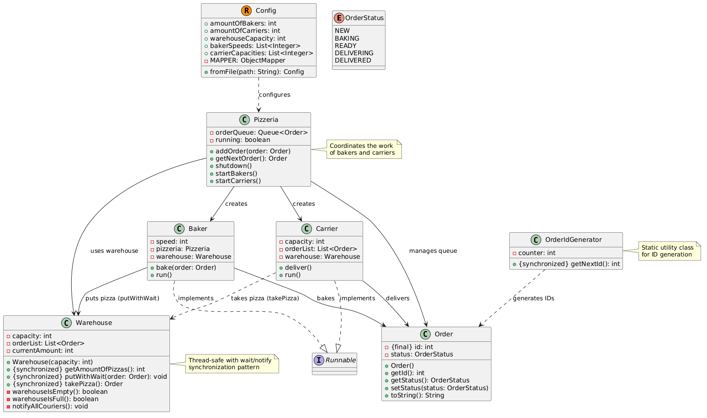

# 🍕 Эмулятор пиццерии

Данный проект представляет собой многопоточную симуляцию работы пиццерии, где пекари готовят заказы, 
а курьеры доставляют их клиентам. Программа демонстрирует принципы параллельного программирования 
в Java с использованием механизмов синхронизации wait/notify.

---

## 🔍 Описание

Эмулятор моделирует работу пиццерии с несколькими потоками выполнения:
- Пекари (Baker) — принимают заказы из очереди, готовят пиццу и помещают готовые заказы на склад.
- Курьеры (Carrier) — забирают готовые заказы со склада и доставляют их клиентам.
- Склад (Warehouse) — буфер с ограниченной вместимостью для синхронизации работы пекарей и курьеров.
- Пиццерия (Pizzeria) — центральный координатор, управляющий очередью заказов и жизненным циклом работников.

Структура классов представлена на диаграмме:


*Рис. 1. Представление пиццерии. Детальное описание классов представлено ниже* TODO Carier - add warehouse

---

##  Архитектура

### Основные компоненты

| Класс            | Описание                                                                                                                             |
|------------------|--------------------------------------------------------------------------------------------------------------------------------------|
| Order            | Модель заказа с уникальным ID и статусом. Генерация ID осуществляется через OrderIdGenerator.                                        |
| OrderStatus      | Перечисление статусов заказа: NEW -> BAKING -> READY -> DELIVERING -> DELIVERED.                                                     |
| OrderIdGenerator | Утилитарный класс для генерации уникальных ID заказов (static synchronized).                                                         |
| Warehouse        | Потокобезопасный склад с ограниченной вместимостью. Использует wait/notify для блокировки потоков при переполнении/опустошении.      |
| Baker            | Поток-пекарь: забирает заказ из очереди пиццерии, готовит его и кладёт на склад.                                                     |
| Carrier          | Поток-курьер: забирает партию готовых заказов со склада и имитирует доставку. Курьер может доставлять несколько заказов одновременно |
| Pizzeria         | Главный класс: управляет очередью заказов, создаёт и запускает потоки пекарей и курьеров.                                            |
| Config           | Класс для загрузки конфигурации из JSON-файла (использует библиотеку Jackson).                                          |

## 🔄 Жизненный цикл заказа

```mermaid
    [*] --> NEW: Создан заказ
    NEW --> BAKING: Пекарь взял заказ
    BAKING --> READY: Пицца приготовлена
    READY --> DELIVERING: Курьер забрал заказ
    DELIVERING --> DELIVERED: Доставка завершена
    DELIVERED --> [*]
```

### Детальное описание этапов:
1. NEW — заказ создан и добавлен в очередь Pizzeria.
2. BAKING — пекарь извлёк заказ из очереди и начал приготовление (имитируется Thread.sleep(1000 / speed)).
3. READY — пицца готова, пекарь помещает её на склад через warehouse.putWithWait().
4. DELIVERING — курьер забрал заказ со склада через warehouse.takePizza() и начал доставку.
5. DELIVERED — заказ доставлен клиенту, вывод в консоль.
## ⚙️ Конфигурация:

Конфигурация загружается из JSON-файла через класс Config. Пример JSON файла представлен ниже

```json
{
  "amountOfBakers": 3,
  "amountOfCarriers": 2,
  "warehouseCapacity": 10,
  "bakerSpeeds": [2, 3, 1],
  "carrierCapacities": [4, 5]
}
```
### Параметры конфигурации:


| Параметр             | Описание                              | Пример    |
| -------------------- | ------------------------------------- | --------- |
| amountOfBakers  <br> | Количество потоков-пекарей            | 3         |
| amountOfCarriers     | Количество потоков-курьеров           | 2         |
| warehouseCapacity    | Максимальное число заказов на складе  | 10        |
| bakerSpeeds          | Скорость каждого пекаря (пицц/сек)    | [2, 3, 1] |
| carrierCapacities    | Вместимость курьера (заказов за рейс) | [4, 5]    |

> Если в списках bakerSpeeds или carrierCapacities меньше значений, чем работников, для остальных используется значение по умолчанию 1.


## ⚡ Особенности реализации
### 🔐 Потокобезопасность
Pizzeria.orderQueue - это очередь заказов из которойберут заказы пекари. Далее поле приготовления заказа
пекари помещают его в Warehouse.orderList.
Pizzeria.orderQueue синхронизирована по 

| Компонент                | Монитор                           | Механизм синхронизации                  |
|--------------------------|-----------------------------------|-----------------------------------------|
| Pizzeria.orderQueue      | объект Pizzeria                   | synchronized + wait/notifyAll           |
| Warehouse.orderList      | объект Warehouse                  | synchronized + wait/notifyAll           |
| OrderIdGenerator.counter | класс OrderIdGenerator            | static synchronized метод               |
| Pizzeria.running         | волатильный флаг boolean running  | volatile для видимости между потоками   |

## 📊 Мониторинг и отладка
Программа выводит в консоль статус каждого заказа:
```
1. Order{id=1, status=BAKING}
2. Order{id=1, status=READY}
3. Order{id=1, status=DELIVERING}
4. Order{id=1, status=DELIVERED}
```
